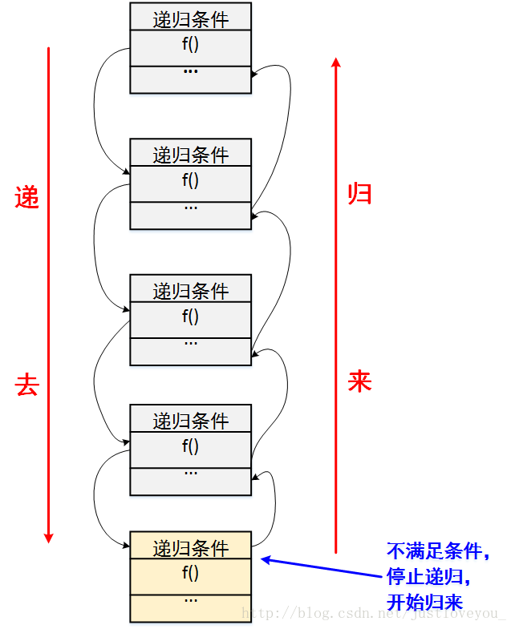

### 一、形象理解递归

​		递归：你打开面前这扇门，看到屋里面还有一扇门。你走过去，发现手中的钥匙还可以打开它，你推开门，发现里面还有一扇门，你继续打开它。若干次之后，你打开面前的门后，发现只有一间屋子，没有门了。然后，你开始原路返回，每走回一间屋子，你数一次，走到入口的时候，你可以回答出你到底用这你把钥匙打开了几扇门。

​		循环：你打开面前这扇门，看到屋里面还有一扇门。你走过去，发现手中的钥匙还可以打开它，你推开门，发现里面还有一扇门（若前面两扇门都一样，那么这扇门和前两扇门也一样；如果第二扇门比第一扇门小，那么这扇门也比第二扇门小，你继续打开这扇门，一直这样继续下去直到打开所有的门。但是，入口处的人始终等不到你回去告诉他答案。
———————————————————————————————————————————————

### 二、递归的内涵

​		递归就是有去（==递去==）有回（==归来==），如下图所示。“有去”是指：递归问题必须可以分解为若干个规模较小，与原问题形式相同的子问题，这些子问题可以用相同的解题思路来解决，就像上面例子中的钥匙可以打开后面所有门上的锁一样；“有回”是指 : 这些问题的演化过程是一个从大到小，由近及远的过程，并且会有一个明确的终点(临界点)，一旦到达了这个临界点，就不用再往更小、更远的地方走下去。最后，从这个临界点开始，原路返回到原点，原问题解决。

​	                             

​		更直接地说，递归的基本思想就是把规模大的问题转化为规模小的相似的子问题来解决。特别地，在函数实现时，因为解决大问题的方法和解决小问题的方法往往是同一个方法，所以就产生了函数调用它自身的情况，这也正是递归的定义所在。格外重要的是，这个解决问题的函数必须有明确的结束条件，否则就会导致无限递归的情况。


### 三、**递归的三要素**

- **明确递归终止条件；**
- **给出递归终止时的处理办法；**
- **提取重复的逻辑，缩小问题规模。**
- 递归函数的参数也是很重要

1) 明确递归终止条件

​		我们知道，递归就是有去有回，既然这样，那么必然应该有一个明确的临界点，程序一旦到达了这个临界点，就不用继续往下递去而是开始实实在在的归来。换句话说，该临界点就是一种简单情境，可以防止无限递归。

2) 给出递归终止时的处理办法

​		我们刚刚说到，在递归的临界点存在一种简单情境，在这种简单情境下，我们应该直接给出问题的解决方案。一般地，在这种情境下，问题的解决方案是直观的、容易的。

3) 提取重复的逻辑，缩小问题规模

​		我们在阐述递归思想内涵时谈到，递归问题必须可以分解为若干个规模较小、与原问题形式相同的子问题，这些子问题可以用相同的解题思路来解决。从程序实现的角度而言，我们需要抽象出一个干净利落的重复的逻辑，以便使用相同的方式解决子问题。


### 四、**递归算法的编程模型**

模型一： 在递去的过程中解决问题

```java
function recursion(大规模){
    if (end_condition){      // 明确的递归终止条件
        end;   // 简单情景
    }else{            // 在将问题转换为子问题的每一步，解决该步中剩余部分的问题
        solve;                // 递去
        recursion(小规模);     // 递到最深处后，不断地归来
    }
}
```

**模型二：** 在归来的过程中解决问题

```java
function recursion(大规模){
    if (end_condition){      // 明确的递归终止条件
        end;   // 简单情景
    }else{            // 先将问题全部描述展开，再由尽头“返回”依次解决每步中剩余部分的问题
        recursion(小规模);     // 递去
        solve;                // 归来
    }
}
```


### 五、递归的应用场景

　 	在我们实际学习工作中，递归算法一般用于解决三类问题：

　　 (1) 问题的定义是按递归定义的（Fibonacci函数，阶乘，…）；

　　 (2) 问题的解法是递归的（有些问题只能使用递归方法来解决，例如，汉诺塔问题，…）；

　　 (3) 数据结构是递归的（链表、树等的操作，包括树的遍历，树的深度，…）。


### 六、递归与循环

​		递归与循环是两种不同的解决问题的典型思路。递归通常很直白地描述了一个问题的求解过程，因此也是最容易被想到解决方式。循环其实和递归具有相同的特性，即做重复任务，但有时使用循环的算法并不会那么清晰地描述解决问题步骤。单从算法设计上看，递归和循环并无优劣之别。然而，在实际开发中，因为函数调用的开销，递归常常会带来性能问题，特别是在求解规模不确定的情况下；而循环因为没有函数调用开销，所以效率会比递归高。递归求解方式和循环求解方式往往可以互换，也就是说，如果用到递归的地方可以很方便使用循环替换，而不影响程序的阅读，那么替换成循环往往是好的。问题的递归实现转换成非递归实现一般需要两步工作：

　　 (1) 自己建立“堆栈(一些局部变量)”来保存这些内容以便代替系统栈，比如树的三种非递归遍历方式；

　　 (2) 把对递归的调用转变为对循环处理。

　