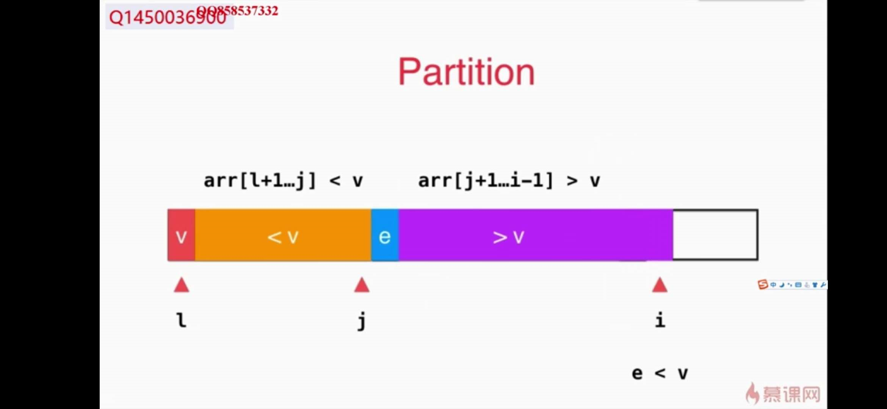
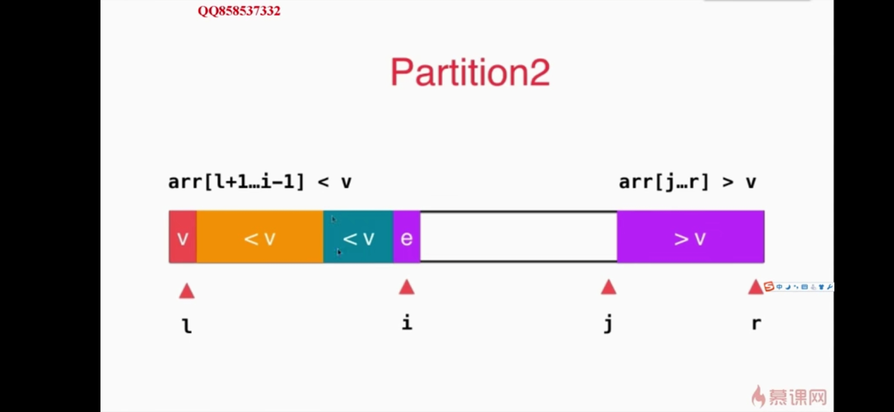
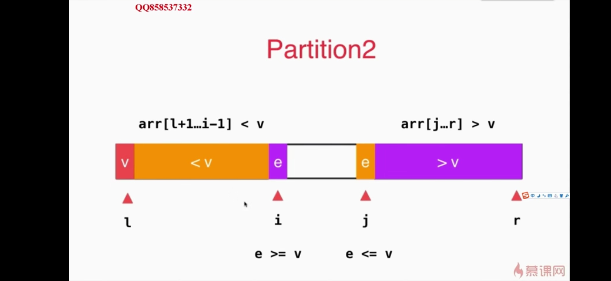

### 第一种方法

i为当前正访问的数组元素索引，j为分界线


第10行代码：





第15行代码：


```java
private static int partition(Comparable[] arr, int l, int r){

        // 随机在arr[l...r]的范围中, 选择一个数值作为标定点pivot
        swap( arr, l , (int)(Math.random()*(r-l+1))+l );

        Comparable v = arr[l];

        int j = l; // arr[l+1...j] < v ; arr[j+1...i) > v
        for( int i = l + 1 ; i <= r ; i ++ )
            if( arr[i].compareTo(v) < 0 ){
                j ++;
                swap(arr, j, i);
            }

        swap(arr, l, j);

        return j;
    }

```


### 第二种方法

```java
 // 双路快速排序的partition
    // 返回p, 使得arr[l...p-1] <= arr[p] ; arr[p+1...r] >= arr[p]
    // 双路快排处理的元素正好等于arr[p]的时候要注意，详见下面的注释：）
    private static int partition(Comparable[] arr, int l, int r){

        // 随机在arr[l...r]的范围中, 选择一个数值作为标定点pivot
        swap( arr, l , (int)(Math.random()*(r-l+1))+l );

        Comparable v = arr[l];

        // arr[l+1...i) <= v; arr(j...r] >= v
        int i = l+1, j = r;
        while( true ){
        // 注意这里的边界, arr[i].compareTo(v) < 0, 不能是arr[i].compareTo(v) <= 0
        // 思考一下为什么?
            while( i <= r && arr[i].compareTo(v) < 0 )
                i ++;

        // 注意这里的边界, arr[j].compareTo(v) > 0, 不能是arr[j].compareTo(v) >= 0
        // 思考一下为什么?
            
            while( j >= l+1 && arr[j].compareTo(v) > 0 )
                j --;

         // 对于上面的两个边界的设定, 有的同学在课程的问答区有很好的回答:)
         // 大家可以参考: http://coding.imooc.com/learn/questiondetail/4920.html

            if( i > j )
                break;

            swap( arr, i, j );
            i ++;
            j --;
        }

        swap(arr, l, j);

        return j;
    }
```

==针对数组中包含大量重复元素的情况，发明了“双路快速排序的partition”==

编写为 partitionDealWithIdenticalKeys 函数


第16行循环终止



第21行循环终止


第30行交换




第31行递减和递增


第27行外层循环终止条件，第35行外层循环结束后，将pivotKey归位.

**==直到 j 访问到 i-1 或者 i 访问到 j+1。循环结束，交换 j 和 l 的元素。结束的时 j 总是比 i 小 1 。==**


另外：边界值不加等于号的原因是

```
不加等于号，一方遇到重复元素会交换，而不是留在自己这，避免了大量重复元素在自己这里囤积
从而避免了重复值在原数组中聚集时，导致分治的不平衡。
```


### 归并排序和快速排序的讨论

都是用了分支算法


### 选择排序算法时考虑的因素

